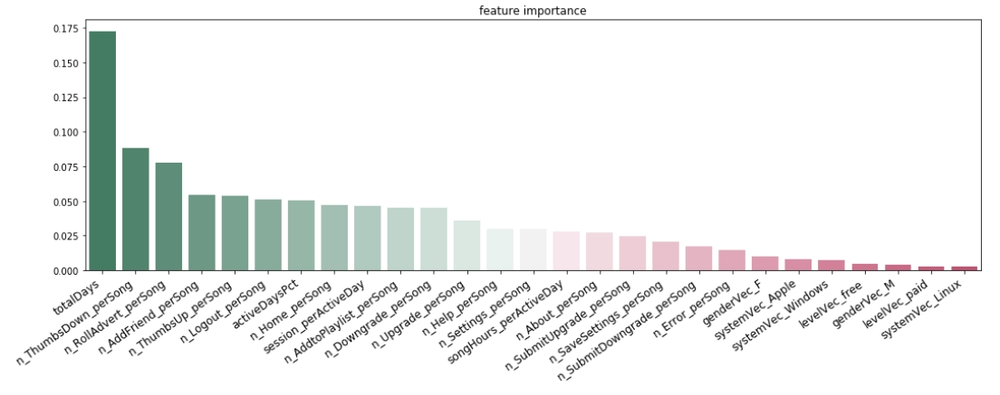

# Sparkify Project
- [Table of Contents](#Table_of_Contents)
  - [1. Background](#1-background)
  - [2. Installation](#2-installation)
  - [3. File Descriptions](#3-file-descriptions)
  - [4. Screenshot of Feature Importances](#4-screenshots-of-feature-importances)
  - [5. Acknowledgements](#5-acknowledgements)

## 1. Background
This project is to analyze data from Sparkify to build a model to predict customer churn. First, a sample dataset (128MB) was used on a local machine to explore relevant features and develop a working model. Then similar steps were used to develop a final working model for the full dataset(12GB). I have learned how to manipulate large and realistic datasets with Spark to engineer relevant features for predicting churn. I have also learned how to use Spark MLlib to build machine learning models with large datasets, far beyond what could be done with non-distributed technologies like scikit-learn. Check my [web blog](https://) for more details.

## 2. Installation
The code was developed using the Anaconda distribution of Python, versions 3.8.1. Python libraries used are `pyspark`, `pandas`, `numpy`, `matplotlib`, `seaborn`

## 3. File Descriptions
* `Sparkify.ipynb` - the project notebook for the small dataset
* `aws.ipynb` - the project notebook for the full dataset

## 4. Screenshot of Feature Importances

## 5. Acknowledgements
Special thanks to [Udacity](https://www.udacity.com/) for providing the dataset.
